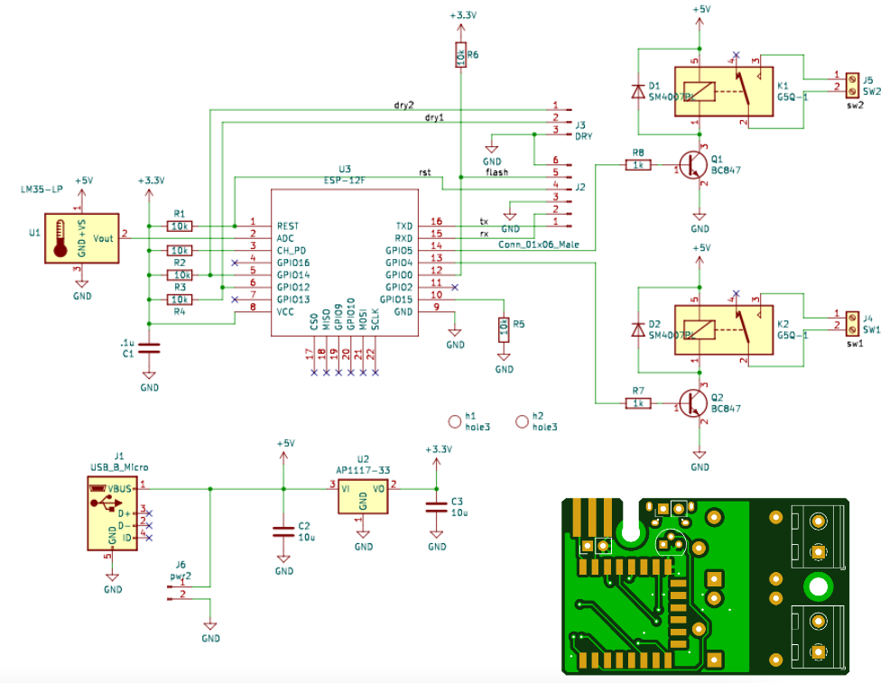
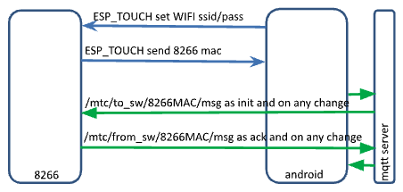
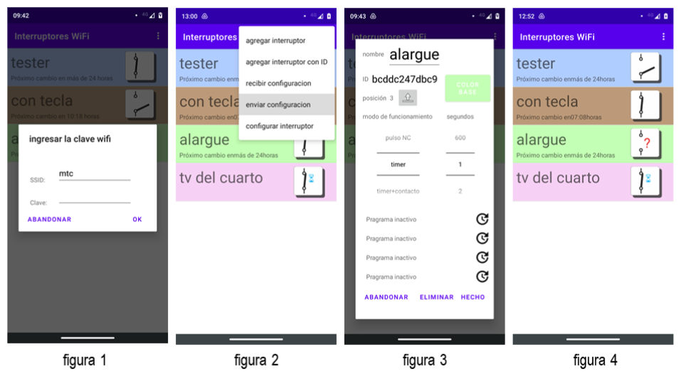
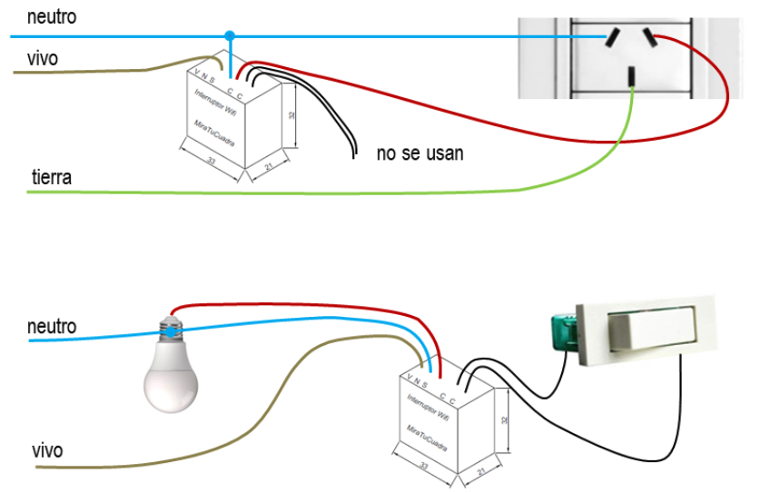
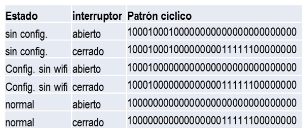

#     WiFi Switch

## Summary

This repository describes how to build a "smart switch" that can be operated remotely over the Internet using a mobile app.

This is an open-source software and hardware project. The circuit diagram and board layout design, the programs in C for the ESP 8266 microcontroller, the program in Kotlin for the Android App, and the program in SwiftUI for the IOS App are all made available under the GPLv3 license. See the file LICENSE.txt in the same directory along with this file.

## Motivation

The project was born from the need to manage my own home heating system. I need a schedule if the temperature is lower than N° and also to add the thermostat functionality. But soon I was using it to manage my garden irrigation, the lights from my home, the garage gateway, etc.

## Hardware

The hardware design is quite simple; just what the Espressif 8266 module needs to operate:

- 5V @ 200mA power supply
- 3.3V regulator
- One or two 220VAC @ 6A relays to control the load(s) 
- Temperature sensor.
- USB

The following pictures show the schematics, boards, and switches with all their elements.

The HW folder in this repository contains documents needed to order boards from [JLCPCB](https://jlcpcb.com/) and Kikad projects for simple and double switches.





## Software

Development is around the MQTT protocol to send orders from the mobile phone to the switch connected to a Wifi network, the name, operating mode, timers, and thresholds are also configured. Additionally, from the mobile app with the mobile connected to the Wi-Fi network to which the switch will connect, the password is sent using the esp-touch protocol developed by Espressif.

### MQTT dialog



MQTT topics to the switch “/mtc/to_sw/8266MACaddress/”, from the switch:  “/mtc/from_sw/8266MACaddress/”, the MQTT message is a JSON string with always the same information structure: 

{"name":"velador","mode":0,"secs":0,"state":"on","prgs":[{"days":0,"start":0,"stop":0},{"days":0,"start":0,"stop":0},{"days":0,"start":0,"stop":0},{"days":0,"start":0,"stop":0}],"tempX10":0}

where:

- name: string up to 32 char
  
- mode:
  
```text  
1. timer
2. timer/cont
3. pulse na
4. pulse nc
5. timer/temp
6. temp
```

- secs: seconds as auxiliary info for pulse mode
  
- tempX10: temperature x 10 (only double switch)

- days: bit 0 = Sanday, bit 1 = Monday ... bit 6 = Saturday

- start: minutes from 0 hs to sw on

- stop: minutes from 0 hs to sw off

- state:

```text
1. off
2. on
3. get_data
4. set_data
5. erase
6. upgrade
7. server fails
8. upgrade fails
9. upgraded
```

### Program in C

The C program for the microcontroller has the following functions:

1. MQTT dialog with the app according to the operation scheme above.
2. Receive configuration data from the app: name, mode, and timers to save them in non-volatile memory to share with other users.
3. Manage esp-touch protocol for the initial connection to a Wi-Fi network and when the network parameters change.
4. Manage the onboard LED of the 8266 board to report the hardware status. See the specifications, below.
5. Manage firmware updates (versions of this C program), through Espressif “over the air” OTA mechanism.
6. The same program is used for one or two switches, the last for the heating system. The config.h file in the project has the key “CALEFA” defined for 2 switches and undefined for one.
7. Add compatibility with Alexa voice commands. http://www.makermusings.com/2015/07/13/amazon-echo-and-home-automation/ was the key point to developing the current version recognized and added as a managed device from Alexa Echo Dot.

### Firmware upgrade procedure

1. From the ESP8266-RTOS-SDK platform generate a new firmware file:

```bash
make ota
```

1. The new file will be in the build directory. Rename it from “switch_control_c.ota.bin” to “switch_control.ota”:

```bash
cd build
```

```bash
rm switch_control.ota
```

```bash
mv switch_control_c.ota.bin switch_control.ota
```

1. Turn on an HTTP server in the above directory listening in XX port:

```bash
python -m http.server XX
```

1. In the Android or IOS app go to config/maintenance/firmware upgrade. From there, load the server address (IP address of the development computer), and XX port.

If the procedure succeeds the switch will turn on with the new firmware and a toast in the app shows “success”, if not, the toast gives some troubleshooting information.

### Android App

This is the switch management app (https:) , i.e. switch (turn on and off), manage connection with a wifi network to aggregate new switches to the app, use mode, timers settings, switch name, background color, and position in the screen, firmware upgrade, erase switches from the app and leave them to factory state. Also from this app, you can copy configured switches from other users.

The app was developed in Kotlin using the MVVM architectural design pattern, Jetpack Compose to design the screens, coroutines, and Dagger Hilt dependency injection.

### Android App upload to Google Play procedure

To upgrade the Android market version do the following:

1. In Studio Project, clone the current anemometer project from Bitbucket. 
2. Upgrade the project and test all new features locally
3. In the file “build. gradle (: app)”, increase the version code and version name by one. Google requires this to upload an upgrade
4. Upgrade the below version history table
5. Generate a new Signed Bundle: Build / Android AppBundle / Next
6. Module: anemometer.app, Key store path: C:\repos\private_key.pepk, Key store password: xxx, Key alias: xxx, Key password: xxx, mark: Export encrypted….., Next
7. Build Variants: release, Finish
8. Open the Google Console, e-lanita/Production/launch the new version
9. Upload the file app-release.aab from C:\repos\anemometer\app\release

It will take about 2 days to be available in Google Play.

version|date|modification|commit|
---|---|---|---|
4(1,4)|10/07/2021|colors||
5(1.5)|13/07/2021|icon||
6(1.6)|5/09/2021|se agregaron modos pulse y reaccion a tecla||
7(1.7)|22/09/2021|varias mejoras de performance, me pase a linode||
8(1.8)|27/09/2021|se colgaba al iniciar||
9(1.9)|27/08/2022|se puede pasar toda la config a otro telefono. Reconoce sw simples||
10(1.10)|6/11/2022|primera version con ESP_Touch||
11(1.11)|18/11/2022|OTA y switches dobles||
12(1.12)|25/11/2022|clean up config multiple|65100d6|
13(1,13)|7/12/2022|niveles de config. Help, timers de + de 24h|f004291|
14(1.14)|31/08/2023|AP1 34, PORQUE LO PIDE GOOGLE|20eec408|
15(1.15)|12/05/2024|Kotlin + JetPackCompose|d29f0ae|
16(1.16)|9/06/2024|MVVM, Dagger-Hilt|dd1f5813|
17(1.17)|16/06/2024|String resources no more hardcoded|085b01e0|
18(1.18)|21/12/2024|color def compatible ios and android|04bf104b|

### IOS App

The iPhone app (https:) has the same facilities as the Android app except for esp-touch integration. You should use the esp-touch app available in AppleStore for free. The issue is that Espressif gives esp-touch libraries for Objective-C but not for SwifttUI. I have a workaround to “translate “ them. The app was developed in SwiftUI 5, using MVVM architectural design patterns and the declarative programming advantages proposed by Apple.

## Final user manual

You turn on and off (close and open) switches with your mobile. You can program schedules, days of the week, and an external contact (NO), such as a rain detector. It has a pulse mode (NO or NC from 1 sec. to 10 min.) for, for example: opening gates and triggering sirens. It comes configured at the factory to work when it detects changes in the contact input, so it can be connected to an existing light key and controlled manually.

The initial configuration (association to a Wi-Fi network), programming (modes/timers), and operation (on/off) are done with the Android App “Wifi Switches” available on Google Play. From this app, you can operate all the switches you want and each switch can be operated by several users who have the application installed and the switch added.

You can turn a switch on and off by touching its icon. The icon shows the real status of each switch, the switches programmed as pulse have an hourglass and if a device is not available due to lack of connectivity, it will show it with a “?”, figure 4



## Configuration

a) To operate from your mobile: in the initial screen or menu choose: add switch. The new switch is configured with your mobile phone connected to the Wi-Fi network to which you will associate it. The App will show you the network (SSID) and you must write the password, figure 1. Then if the password is correct, the switch is accessible and not previously configured, and you will go to the configuration screen, where you will have to define: the name, operation mode, response time if pulse mode, background color, and relative position. In the example, figure 3, the name is “alargue” and the mode is “timers”.

b) Add an existing switch to your mobile: The add switch with ID option on the home screen or menu will ask you for a valid ID that can be given to you by whoever configured the switch following the previous point. The ID of that switch is seen below the name on the configuration screen, figure 3.

c) Replicate all the switches from one mobile to another: The receive configuration option on the initial screen or menu will show you an ID to copy to the mobile on which the switches are already configured, in the send configuration menu option. If both mobile phones have connectivity, they will be identically configured. Subsequent modifications to one mobile phone do not affect the other.

You can add or delete switches, and modify the name, operating mode, background color, relative position, and the days and hours of operation of each switch, by going to the menu options. If the configured Wi-Fi network is unreachable, you can rescue it by following the steps in a).

## Installation

To turn on and off outlets or lights, the Wi-Fi switch can be installed inside the existing standard 100 x 50 mm box. Below are the respective diagrams.



## Specifications

Size 33 x 32 x 21 mm

Input voltage 100 to 230 Vac

Maximum load 6A

Wifi 802.11 b/g/nBlue led status indication. Blink as per the table where 1 is on for 100 msec and O off.



## Futures releases

1. Replace the current switching power supply from 220Vac to 5Vdc for something smoller, chip, and integrated.
2. Replace the relays for a solid-state switch.
3. Compatibility with Alexa and Google Home.
4. Integrate esp-touch to the IOS app.