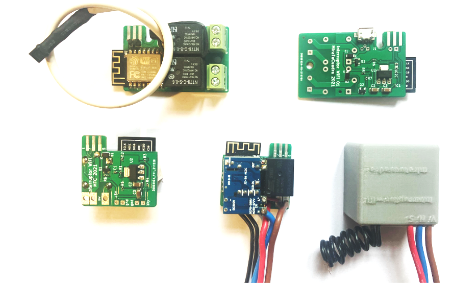

#     WiFi Switch

## Summary

This repository describes how to build a "thermostat" to make yogurt keeping temp around 40 °C turning on and off a heater source.

This is an open-source software and hardware project. The circuit diagram and board layout design, the programs in C for the ESP 8266 microcontroller are made available under the GPLv3 license. See the file LICENSE.txt in the same directory along with this file.

## Motivation

The project was born from the need to manage my own home heating system. I need a schedule if the temperature is lower than N° and also to add the thermostat functionality. But soon I was using it to manage my garden irrigation, the lights from my home, the garage gateway, etc.

## Hardware

The hardware design is quite simple; just what the Espressif 8266 module needs to operate:

- 5V @ 200mA power supply
- 3.3V regulator
- One 220VAC @ 6A relays to control the load(s)
- DS18B20 temperature sensor(HW/DS18B20.pdf)
.

The following pictures show the schematics, boards, and switches with all their elements.

The HW folder in this repository contains documents needed to order boards from [JLCPCB](https://jlcpcb.com/) and Kikad projects for simple and double switches.

