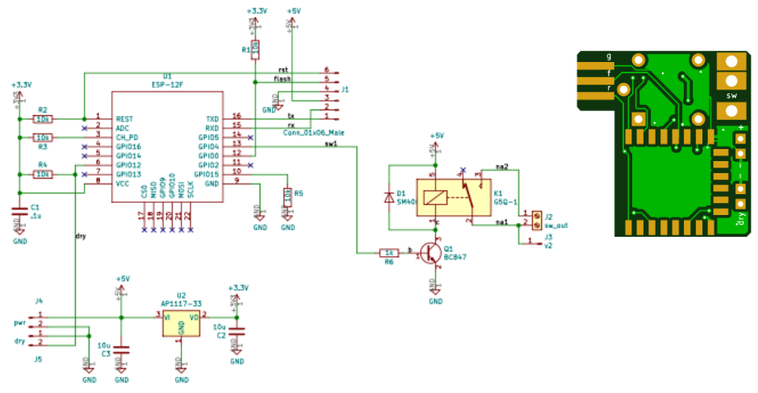

# Thermostat

## Summary

This repository describes how to build a "thermostat" to make yogurt keeping temp around 40 °C turning on and off a heater source.

This is an open-source software and hardware project. The circuit diagram and board layout design, the programs in C for the ESP 8266 microcontroller are made available under the GPLv3 license. See the file LICENSE.txt in the same directory along with this file.

## Hardware

The hardware design is quite simple; just what the Espressif 8266 module needs to operate:

- 5V @ 200mA power supply
- 3.3V regulator
- One 220VAC @ 6A relays to control the load(s)
- DS18B20 temperature sensor(HW/DS18B20.pdf)

The following pictures show the schematics, boards, and switches with all their elements.

The HW folder in this repository contains documents needed to order boards from [JLCPCB](https://jlcpcb.com/) and Kikad projects for simple and double switches.

## Software

There is a simple periodic task that keep the switch on until 41°C, the upper side of the histeresis and turn it on again under 39°C, the lowwer side of the histeresis.
To read the temperature I used other open source project: [one_wire](https://github.com/estebanc2/one_wire)